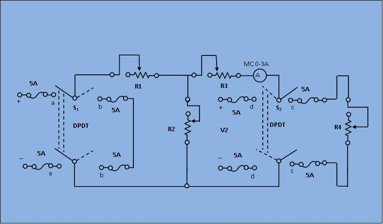

### Procedure

                            
                            

								 <figure style="text-align:center">
									  
								 <figcaption>[Fig 1: Circuit diagram for Experimental set up]</figcaption>
								    </figure>
                                     
								<ol type="1">
                                <li>Keep all the resistance close to their maximum respective values.</li>
								<li>Close the switch s1 to "aa" and s2 to "cc" positions. Observes the load current IL and voltage VL readings. The load resistance,
                                 	
                                RL = VL / IL								
                                </li> 
								<li>Short the load terminals and find the short circuited current 
                                Isc.</li>
							   <li>Next, compute the resistance Rint of the network as seen from the load terminals, 
									<ul>
									<li>Replace the 220 V source by a short by closing s1 to "bb".
                                    </li>
									<li>Apply V=110 V at the output terminals by closing s2 to "dd". Read the current from ammeter (I) and get
									Rint = V/I </li>
									</ul>
                                    </li>
							        <li>Now compute the load current IL applying Norton theorem.</li>
									$$I_L=I_{sc}\frac{R_{int}}{(R_{int}+R_L)}$$ 
								    <li>Compare the above computed load current with its observed value in step (2) and verify the theorem.</li>
								    </ol>
                                      
                                      
                                      
							         
                                
                                    
