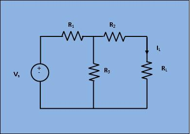
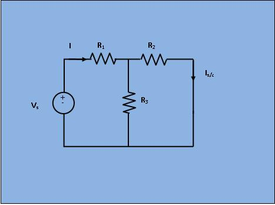
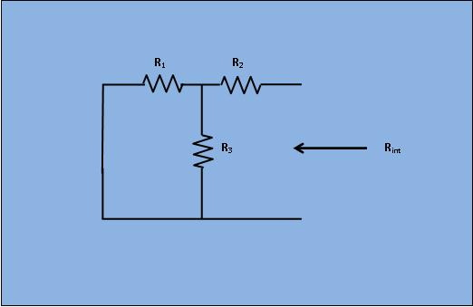
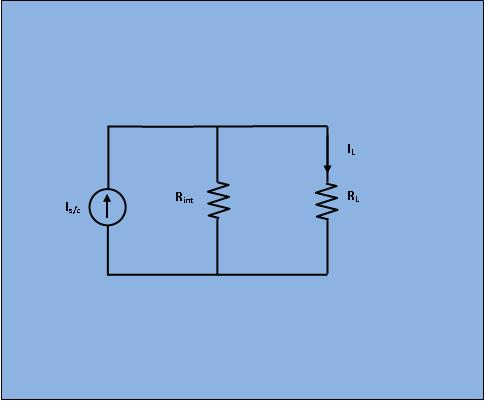

### Theory

 A linear active network consisting of independent and(or) dependent voltage and current sources and linear bilateral network elements can be replaced by an equivalent circuit consisting of current sources in parallel with the resistance, the current source being the short circuited current across the load terminal and resistance being the internal resistance of the source network looking through the open circuited load terminals. In order to find the current through<b>RL</b>, the load resistance of the figure 1 by Norton's theorem, let,replace <b>RL</b> by short circuit as shown in figure 2.

<!-- <h2>Circuit diagram:</h2>  -->
 <figure style="text-align:center">

<figcaption>[Fig 1: Circuit with source VS and Load RL]</figcaption>
</figure>									
<figure style="text-align:center">

<figcaption>[Fig 2: Circuit with <b>RL</b> shorted]
</figcaption>
</figure>

Obviously, in Fig 2;
$$I=\frac{V_s}{R_1+\frac{R_2 * R_3}{R_2 + R_3}}$$  
$$I_{s/c}= I\frac{R_3}{R_3 + R_2}$$ 
Next, the short circuit is removed and the independent source is deactivated as shown in figure 3.

 <figure style="text-align:center">

<figcaption>
[Fig 3: Circuit with source Vs deactivated and Load RL open]
</figcaption>
</figure>
From Fig 3;
$$R_{int}= R_2+ \frac{R_1*R_3}{R_1+R_3}$$
 
As per Norton's theorem , the equivalent circuit as shown in figure 4, would contain a current source in parallel to the internal resistance, the current source being the short circuited current across the shorted terminals of the load resistor.

 <figure style="text-align:center">

<figcaption>[Fig 4: Norton equivalent circuit]
</figcaption>
</figure>									

Obviously, from Fig 4; 
$$I_{L}= I_{s/c}\frac{R_{int}}{R_{int}+R_L}$$

   

                    